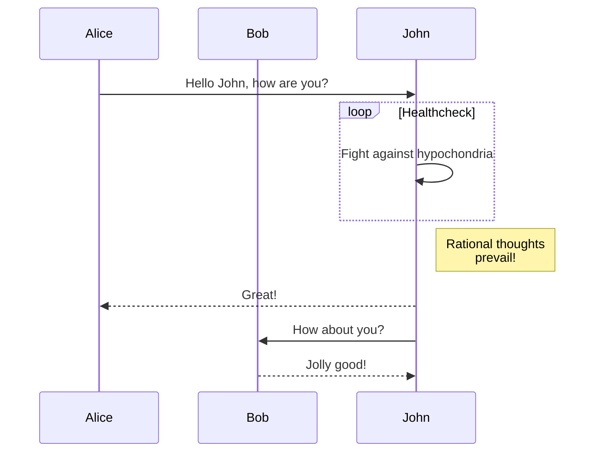
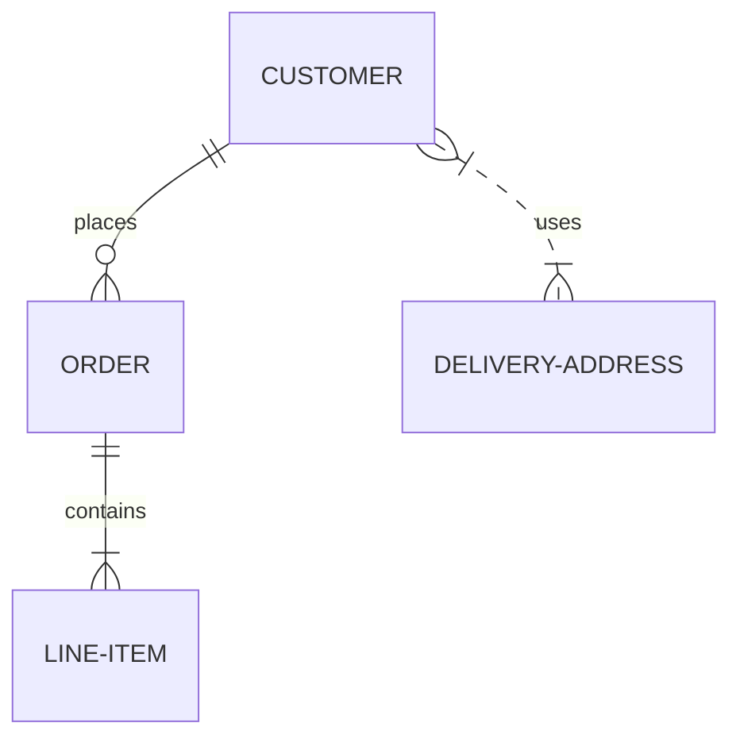

# Examples of Mermaid Markdown in GitHub

Here are some examples illustrating how GitHub markdown supports Mermaid code blocks for embedded graphs.  For more information, see the [Mermaid project pages](https://mermaid-js.github.io/mermaid/#/) and [repository](https://github.com/mermaid-js/mermaid).

## Graphs

## Sequence Diagrams

## Entity Relationship Diagrams 

